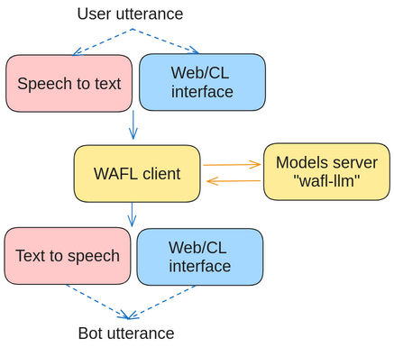

#  WAFL 0.1.0 [](https://github.com/fractalego/wafl/actions/workflows/development-tests1.yml)[](https://wafl.readthedocs.io/en/latest/)

Introduction
============

WAFL is a framework for personal agents. It integrates Large language models, speech recognition and text to speech.
This framework combines Large Language Models and rules to create a predictable behavior. 
A set of rules is used to define the behavior of the agent, supporting function calling and a working memory.
The current version requires the user to specify the rules to follow.

Installation
============

In this version, WAFL is a two-part system.
Both can be installed on the same machine.




## Interface side


The first part is local to your machine and needs to have access to a microphone and speaker.
To install it, run the following commands:

```bash 
$ sudo apt-get install portaudio19-dev ffmpeg
$ pip install wafl
```

After installing the requirements, you can initialize the interface by running the following command:

```bash
$ wafl init
```

which creates a `config.json` file that you can edit to change the default settings.
A standard rule file is also created as `wafl.rules`.
Please see the examples in the following chapters.


## LLM side (needs a GPU)
The second part (LLM side) is a model server for the speech-to-text model, the LLM, the embedding system, and the text-to-speech model.

#### Installation
In order to quickly run the LLM side, you can use the following installation commands:
```bash
pip install wafl-llm
wafl-llm start
```
which will use the default models and start the server on port 8080.

The interface side has a `config.json` file that needs to be filled with the IP address of the LLM side.
The default is localhost.
Alternatively, you can run the LLM side by cloning [this repository](https://github.com/fractalego/wafl-llm).


Running WAFL
============
This document contains a few examples of how to use the `wafl` CLI.
There are four modes in which to run the system


### $ wafl run
Starts all the available interfaces of the chatbot at the same time.


## $ wafl run-audio

This is the main mode of operation. It will run the system in a loop, waiting for the user to speak a command.
The activation word is the name defined in config.json.
The default name is "computer", but you can change it to whatever you want.


## $ wafl run-server

It runs a local web server that listens for HTTP requests on port 8090.
The server will act as a chatbot, executing commands and returning the result as defined in the rules.


## $ wafl run-cli

This command works as for the run-server command, but it will listen for commands on the command line.
It does not run a webserver and is useful for testing purposes.


## $ wafl run-tests

This command will run all the tests defined in the file testcases.txt.


Documentation
=============

The documentation can be found at [wafl.readthedocs.io](https://wafl.readthedocs.io).


<a rel="me" href="https://fractalego.social/@wafl">Mastodon</a>
