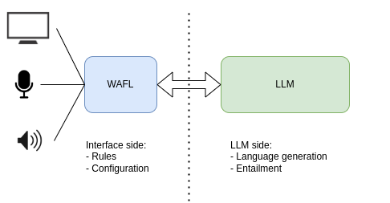

Installation
============

In this version, WAFL is built to run as a two-part system.
Both can be installed on the same machine.

Interface side
--------------

The first part is local to your machine and needs to have access to a microphone and speaker.
To install it, run the following commands:

.. code-block:: bash

    $ sudo apt-get install portaudio19-dev ffmpeg
    $ pip install wafl

After installing the requirements, you can initialize the interface by running the following command:

.. code-block:: bash

    $ wafl init

which creates a `config.json` file that you can edit to change the default settings.
A standard rule file is also created as `wafl.rules`.
Please see the examples in the following chapters.

LLM side (needs a GPU)
----------------------
The second part (LLM side) is a model server for the speech-to-text model, the LLM, the embedding system, and the text-to-speech model.
In order to quickly run the LLM side, you can use the following installation commands:

.. code-block:: bash

    $ pip install wafl-llm
    $ wafl-llm start

    which will use the default models and start the server on port 8080.

Alternatively, a Docker image can be used to run it as in the following:

.. code-block:: bash

    $ docker run -p8080:8080 --env NVIDIA_DISABLE_REQUIRE=1 --gpus all fractalego/wafl-llm:0.80

The interface side has a `config.json` file that needs to be filled with the IP address of the LLM side.
The default is localhost.

Finally, you can run the LLM side by cloning [this repository](https://github.com/fractalego/wafl-llm).
