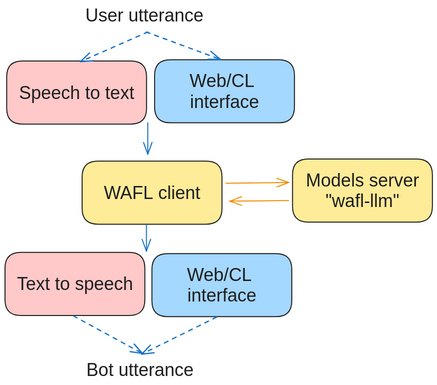

Installation
============

In this version, WAFL is built to run as a two-part system.
Both can be installed on the same machine.

Interface side
--------------

The first part is local to your machine and needs to have access to a microphone and speaker.
To install it, run the following commands:

.. code-block:: bash

    $ sudo apt-get install portaudio19-dev ffmpeg
    $ pip install wafl

After installing the requirements, you can initialize the interface by running the following command:

.. code-block:: bash

    $ wafl init

which creates a `config.json` file that you can edit to change the default settings.
A standard rule file is also created as `wafl.rules`.
Please see the examples in the following chapters.

LLM side (needs a GPU)
----------------------

The second part is a machine that runs on a machine accessible from the interface side.
The initial configuration is for a local deployment of language models.
No action is needed to run WAFL if you want to run it as a local instance.

However, a multi-user setup will benefit for a dedicated server.
In this case, a docker image can be used

.. code-block:: bash

    $ docker run -p8080:8080 --env NVIDIA_DISABLE_REQUIRE=1 --gpus all fractalego/wafl-llm:latest

The interface side has a `config.json` file that needs to be filled with the IP address of the LLM side.
The default is localhost.
Alternatively, you can run the LLM side by cloning `this repository <https://github.com/fractalego/wafl-llm>`_.

