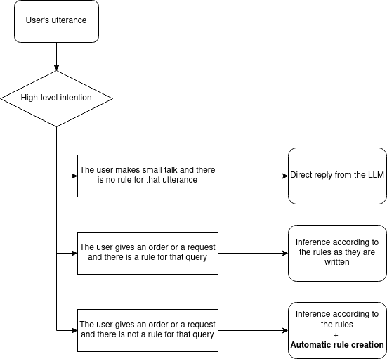

Query processing pipeline
=========================

WAFL will try to answer the user's query as in the following diagram

The reply flow from the bot is divided into three main branches:

* Direct reply from the LLM
* Inference according to the rules as they are written
* Rule creation if there are no rules to accomplish the user's query

